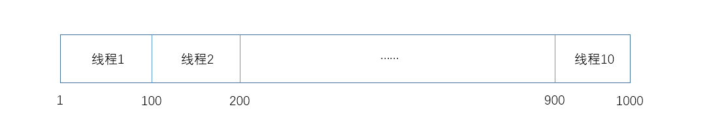
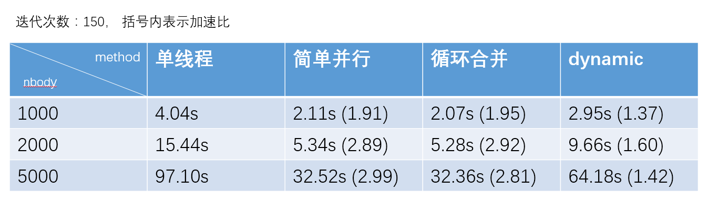
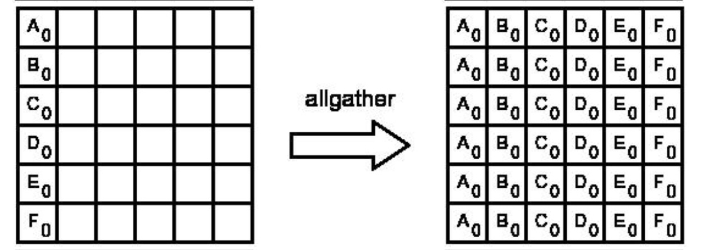
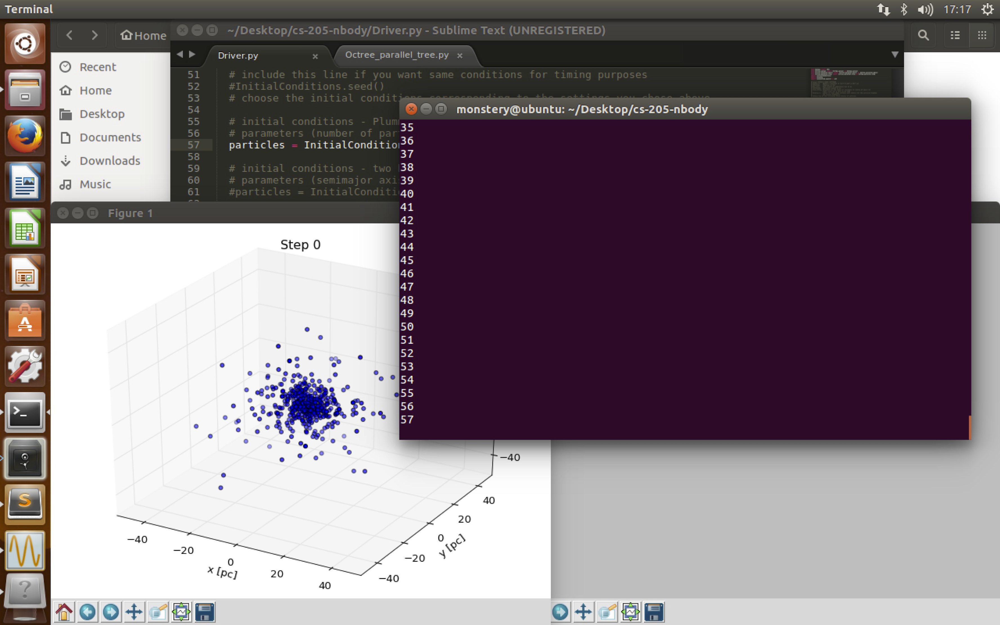

#**CS433** 并行与分布式程序设计
#Project2实验报告
**Group16**:秦格华 刘宸林
##1 并行思路
### 1.1 循环并行
在Nbody问题的每一次迭代中，`position_step()`都对每个星体进行了如下的操作： a). 遍历所有星体，计算其他星体对当前星体的引力值； b). 根据所得的引力值，计算当前时间点该星体速度的x和y分量，并且更新该星体的坐标。
可以看出，`position_step()`函数是O(n^2)的。在第一层循环中，对每个星体进行更新；在第二层循环中，利用其他星体的数据来更新该星体受到的引力。

```c
    for (i = 0; i < world->num_bodies; i++) {
        for (j = 0; j < world->num_bodies; j++) {
        ...
        ...
        ｝
    ｝
```
很自然的，我们联想到了OpenMP中提供的循环并行方法，可以直接将该循环拆分之后分散给线程进行运算，从而提高CPU的利用率，以达到加速的效果。
在OpenMP中，语句`#pragma omp parallel for {}`是用来对for痪进行并行处理的。该语句可以自动的将大括号（或者紧跟其后）的for循环语句进行并行处理。
但是，在这里，一共有关于i和关于j的两层循环，而显然，我们只能将其中一层循环并行化。那么，到底应该选择外层循环还是内层循环呢？

### 1.2 选择外层循环并行化的原因
考虑到需要提高对cache的友好度，我们选择并行化外层循环来提高***Temporal Locality***以及***Spatial Locality***。
关于***Temporal Locality***： 
由于内层循环的操作从0开始一次访问结构体数组中的成员，我们可以很自然的想到，如果我们将外层循环进行并行化，那么在内层循环中，同一个星体就有可能同时被多个线程访问，这样就显著的提高了***Temporal Locality***。如果我们并行化内层循环，同一个星体需要等到外层循环进行到下一步的时候才能再次被访问，这就有可能造成多余的cache存取操作，从而降低运行速度。
关于
关于***Spatial Locality***：
我们知道，c语言的数组在cache中是行相关的，本次使用的结构体数组也是一样的。所以，为了提高***Spatial Locality***， 我们对内存的访问应该尽量按照行相关的顺序来进行。由于内层循环的访问顺序正好是对数组从前向后依次遍历，所以在不打乱内层循环的前提下，我们对外层循环进行并行处理，并不会违背***Spatial Locality***的原则。同时，如果对内层循环进行并行化，很可能由于线程调度策略选择的问题，导致无法保证以行相关的顺序访问，这样反而会降低cache友好度。
因此，我们在外层循环前加入并行化语句。

```c
#pragma opm parallel for 
    for (i = 0; i < world->num_bodies; i++) {
        for (j = 0; j < world->num_bodies; j++) {
        ...
        ...
        ｝
    ｝
```

### 1.3 提高cache友好度
从1.2中我们知道，选择外层循环可以有效提高cache友好度。
再次回到`position_step()`函数，除了计算引力的两层循环，我们还有另外一个循环来对每一个星体进行当前速度以及坐标的计算，该循环如下：

```c
    for (i = 0; i < world->num_bodies; i++) {
        // Update velocities
        ......	
        // Update positions
        ......
    }	
```
当然，我们可以再次对于这个循环进行并行化的处理。但是，我们注意到该循环的访问顺序和上一个循环的外层循环是一样的，都是从0开始访问每一个星体，我们考虑到，如果能将这个循环并入上个循环，那么就能保证每个星体在计算引力之后能立即对速度和位置进行更新，从而有效的提高***Temporal Locality***以提高cache友好度。
这显然是很容易办到的，只要将该循环中的操纵放入上一个循环中的内层循环之后，保证在计算了引力之后再对速度和位置进行更新即可，代码如下：

```c
#pragma opm parallel for 
    for (i = 0; i < world->num_bodies; i++) {
        for (j = 0; j < world->num_bodies; j++) {
       //Clculate the force
       ......
        ｝
        //Update velocities
        ......	
        // Update positions
        ......
    ｝

```

### 1.4 变量本地化
在并行化时，我们需要考虑变量本地化的问题。由于某些变量是会被每个线程同时写入，这些变量则必须进行本地化的操作。在OpenMP中，我们可以利用`private()`语句来将变量私有化，或者，我们也可以将变量的定义放在并行部分来进行本地化。
加入变量本地化之后的代码如下：

```c
#pragma opm parallel for private(j)
    for (i = 0; i < world->num_bodies; i++) {
        double d, d_cubed, diff_x, diff_y; 	
        for (j = 0; j < world->num_bodies; j++) {
        //Clculate the force
        ......
        ｝
        //Update velocities
        ......	
        // Update positions
        ......
    ｝

```

###1.5 线程调度
`#pragma opm parallel for`语句的默认线程调度方法是***static***的方法，即将循环静态的均分给每一个线程。假如我们有1000次迭代，并且有10个线程对这些迭代进行分配：



这种情况下，每个线程独立的进行自己那部分的迭代，不仅严重的违背了***Spatial Locality***， 同时还可能造成大量的***false sharing***。

为了解决这个问题，我们将采取***Dynamic***的线程调度方法。
在***Dynamic***的调度方法中，并不是预想将迭代任务分配给每个线程，而是在运算的过程中动态的进行分配。例如，首先将迭代1-10分配给线程1-10，接着就等待线程完成任务，如果线程5首先完成了任务，那么就继续将迭代11分配给线程5，以此类推。
可以看出，在***Dynamic***的调度方法中，对内存的访问是严格按照行相关的顺序进行的，也就是说此方法具有良好的***Spatial Locality***。
同时，为了避免***false sharing***，我们可以让每一个线程每次取满一个cache line的容量，这样就能保证线程之间不会发生***false sharing***。

在OpenMP中，可以添加`schedule(dynamic)`语句来更改调度策略，同时，我们还可以设定每次分配给线程的最小迭代次数。假如运行环境的L1 cache line的大小是64byte，而一个double = 8byte，所以我们可以设定每次分配8个迭代给每个线程，即`shcedule(dynamic, 8)`
加入调度策略更改后的程序如下：

```c
#pragma opm parallel for private(j) schedule(dynamic)
    for (i = 0; i < world->num_bodies; i++) {
        double d, d_cubed, diff_x, diff_y; 	
        for (j = 0; j < world->num_bodies; j++) {
        //Clculate the force
        ......
        ｝
        //Update velocities
        ......	
        // Update positions
        ......
    ｝

```

##2 实验数据
在上述并行操作以及cache友好度相关的优化中，我们一共使用了一下操作：
> 1. 外层循环并行化
> 2. 两个循环合并以提高***Spatial Locality***
> 3. 更改线程调度方法为dynamic

在实验中，我们设置的迭代次数为100，星体数目分别为1000、2000、5000，***每个实验结果都是重复进行了三次以上后取平均值得到的***：



可以看出：

* 1. 简单并行的方法得到了非常好的效果，在数据量较大的情况下加速比接近3。
* 2. 循环合并的方法有较微小的提升，意义不大。
* 3. dynamic的线程调度方法反而降低了加速比，可见cache的友好度的提升并不足以抵消dynamic策略本身动态分配任务所消耗的时间。

##Bonus: the Barnes-Hut algorithm
 Barnes-Hut算法是快速求解N-body问题的一种有效方法，本算法主要利用了一种新的数据结构Barnes-Hut Tree来实现对区域进行划分。有关Barnes-Hut算法的详细说明在助教给出的参考网站<http://portillo.ca/nbody/barnes-hut/>已经有了非常详细的说明，这里不再赘述，在此仅详细说明并行化思路。
###Data Structure: Barnes-Hut Tree 
在实现Barnes-Hut Tree时，我们先将所有的点的值依次加入根节点的值。每当一个点加入一个cell，此cell的中心质量就会被更新，之后的步骤为：

* 1.如果本来这个cell就是空的，那就把这个cell的相关联的点设为此点，并将这个cell的值加一；
* 2.如果本来这个cell里已经有一个点了，那么先为这个cell创建8个child cell，把新加入的这个点和原来在parent cell里的点全部分配在child cell里，并将parent cell里的点的记录删除；
* 3.如果本来这个cell有不止一个点，那么仅需要把新加入的点选取一个child cell加入即可。

```python
class Particle:
	//对点的坐标进行初始化
	__init__(self, x, y, z, vx, vy, vz, name)
	//如果点在soften距离外，则就可以利用cell的中心质量近似计算
	kick(self, cell, NEWTON_G, TIMESTEP, SOFTENING)
	//对点进行位置的更新
	drift(self, TIMESTEP)

```

```python
class Cell:
	//对cell的坐标进行初始化
	__init__(self, xmin, xmax, ymin, ymax, zmin, zmax, name)
	//检查一个点是不是在此cell内
	incell(self, x, y, z)
	//将一个点加入此cell
	add(self, particle)
	//为一个cell创建child cell
	makedaughters(self)
	//为一个cell进行child cell的分配
	assigndaughters(self, daughters)
	//判断一个cell是不是足够远到可以进行近似计算
	meetscriterion(self, particle, TREE_THRES, SOFTENING)
```
（***注：***此部分代码来自助教给出的参考网站<http://portillo.ca/nbody/barnes-hut/>)


初始时对根节点进行处理，这一划分就可以递归进行下去，最后我们就可以生成一棵Barnes-Hut Tree。
###一般并行化思路
* 1.在根进程进行初始化工作
* 2.建立Barnes-Hut Tree；
* 3.根进程将Tree广播给每一个子进程；
* 4.每个子进程负责一部分点，计算这部分点和整个Tree内的其他点的相互作用；
* 5.根进程回收每个子进程计算得出的结果，并利用新的状态更新整棵树上的状态；
* 6.回到步骤2，直至迭代次数达到期望值

可以从上面看出，这一并行化思路实际上并行部分仅存在在每个子进程计算相互作用时，而每一次迭代都需要重新回到串行，由根进程更新整棵树的状态后才可以回到并行状态。另外，由于根进程必须将整棵树都进行广播，并行进程也需要将计算得出的结果（整棵树）发送回根进程，这一过程带来的通信开销一定较大。所以这是一种比较简单的并行化思路。


建树过程：

```python
if self.rank == 0:
      root = Cell(-self.box_size, self.box_size, -self.box_size, \
        self.box_size, -self.box_size, self.box_size, "0")
      for particle in self.particles:
        root.add(particle)
```

广播过程：

```python
root = self.comm.bcast(root, root = 0)
```

子进程计算过程：

```python
    self.particles = root.particles()

    nparticles = len(self.particles) / self.size
    extras = len(self.particles) % self.size
    if self.rank < extras:
      start = self.rank * (nparticles + 1)
      end = start + nparticles + 1
    else:
      start = self.rank * nparticles + extras
      end = start + nparticles
    myparticles = self.particles[start:end]

    for particle in myparticles:
      cells = [root]
      while cells:
        cell = cells.pop()
        if cell.meetscriterion(particle, self.tree_thres, self.softening):
          if cell.n > 0:
            particle.kick(cell, self.newton_g, self.timestep, self.softening)
        else:
          cells.extend(cell.daughters)
      particle.drift(self.timestep)
```

回收过程：

```python
particlelists = self.comm.gather(myparticles, root = 0)
    if self.rank == 0:
      self.particles = []
      for particlelist in particlelists:
        self.particles.extend(particlelist)
```

###最终并行化思路
* 1.在根进程进行初始化工作，并直接将每个点的位置、速度信息广播给所有的子进程；
* 2.每个子进程，只进行分到自己的那部分点的建树工作；
* 3.根进程将所有的子进程建的枝进行回收，构成一颗完整的Barnes-Hut Tree；
* 4.根进程将整棵树信息广播出去；
* 5.每个子进程负责一部分点，计算这部分点和整个Tree内的其他点的相互作用；
* 6.子进程直接利用allgather函数收集每个子进程计算出的新的点的信息；
* 7.回到步骤2，直到迭代次数达到期望值

这一并行化思路的主要启发点是allgather函数的特性:


<div  align="center">    

</div>


其可以将新的计算结果全部分发给每个进程，从而使建树的工作也可部分并行化，使得整个流程中只有组成整棵树的时候存在串行计算。

各自建树过程：

```python
root = Cell(-self.box_size, self.box_size, -self.box_size, self.box_size, \
      -self.box_size, self.box_size, "0")
    root.makedaughters()
    granddaughters = []
    for daughter in root.daughters:
      daughter.makedaughters()
      granddaughters.extend(daughter.daughters)
    
    subgranddaughters = granddaughters[self.rank::self.size]

    for particle in self.particles:
      for granddaughter in subgranddaughters:
        granddaughter.add(particle) 
```

收集树枝建树过程：

```python
granddaughterlists = self.comm.gather(subgranddaughters, root = 0)
    if self.rank == 0:
      granddaughters = [] 
      for granddaughterlist in granddaughterlists:
        granddaughters.extend(granddaughterlist)

      root = Cell(-self.box_size, self.box_size, -self.box_size, \
        self.box_size, -self.box_size, self.box_size, "0")
      root.makedaughters()

      for i, daughter in enumerate(root.daughters):
        mygranddaughters = granddaughters[i*8:(i+1)*8]
        daughter.assigndaughters(mygranddaughters)

      root.assigndaughters(root.daughters)
```

广播树（同上，略）

子进程计算过程（同上，略）

更新各点信息：

```python
particlelists = self.comm.allgather(myparticles)
    self.particles = []
   
    for particlelist in particlelists:
      self.particles.extend(particlelist)
```

###测试结果
运行实例：

<div  align="center">    

</div>
由于我们只在单机（单处理器，4 core）上进行了测试，下面是单机测试的结果(单位：秒）：

| #particles  | serial(n=2)| basic(n=2)|final(n=2)|
|:------------- |:---------------:| -------------:| -------------:|
| 100     | 7.398730039596558  |5.801186800003052|5.722530841827393|
|500 | 105.86367392539978|66.55828738212585|65.40859770774841|

| #particles  |serial(n=4)|basic(n=4)|final(n=4)|
|:------------- |:---------------:| -------------:| -------------:| 
| 100    |14.12525486946106 |7.171090841293335|8.555819272994995|
| 500      |        214.0167419910431 |74.87617063522339|83.0267276763916|

下面是加速比结果：

| #particles  |serial(n=2)|basic(n=2)|final(n=2)|
|:------------- |:---------------:| -------------:| -------------:| 
| 100    |1 |1.27538214070139|1.29291221735625|
| 500      |        1 |1.5905408340454|1.61849783721719|

| #particles  | serial(n=4)| basic(n=4)|final(n=4)|
|:------------- |:---------------:| -------------:| -------------:|
| 100     | 1  |1.96974981660022|1.65095292674602|
|500 | 1|2.85827573946957|2.57768489714786|

绘图如下（左边为#particles=100，右边为#particles=500）：


###结果分析
首先，对于任意一个并行程序，我们都得到了大于1的加速比。

但是由于程序并不是完全并行的，所以显然无法达到完美加速比。对于n=2时，我们优化后的并行算法要略微比优化前的并行算法的加速比高一些，这符合我们优化的目的。但是对于n=4时，虽然得到的加速比均要高过n=2时的加速比，但令人意外的是出现了优化前算法比优化后算法加速比高的现象。为了解释这一现象，我们对程序运行过程中的各个步骤，按照我们之前对算法流程的分解进行了测时。
下面是n=4时未优化算法的各步骤耗费时间：

```
/****************************************************/
/*              Octree Parallel Basic               */
/****************************************************/

Tree construction time:  0.6149981021881104  sec
Broadcast time:  3.2539896965026855 sec
Force computation:  2.892432689666748  sec
Gather time:   0.409670352935791 sec
TOTAL = 7.171090841293335 sec

```

下面是优化后各步骤耗费时间：

```
/****************************************************/
/*              Octree Parallel Tree                */
/****************************************************/

Tree construction time:   0.2001333236694336 sec
Tree assembly time: 1.1009385585784912 sec
Broadcast time:  3.0562713146209717 sec
Force computation:  3.4207682609558105  sec
Allgather time:  0.7777078151702881 sec
TOTAL =  8.555819272994995s
```
对比上面两组数据可以看出，对于优化后的代码，虽然由于建树操作的一部分分配给了子进程，但是由于子进程需要建好自己的枝后再发送给根进程组装，所以这一组装的时间再加上通信的时间实际上一定程度上延长了建树操作的时间。另外，`Allgather`操作相比较`gather`操作要进行的复制等操作数更多，所以这一时间也会增加。最后造成优化后算法性能反而下降的现象。

但是对于n=2的情况，由于只存在两个并行进程，通信操作和收发操作的对象都比较少，所以在这样的情况下优化后的算法加速比的确会比优化前算法高。

####关于python并行的问题
在看到网站提供的python版的并行代码，我产生了一点疑惑：对于解释型语言（例如python，perl，PHP等），一般而言是不支持多线程的，而python比较独特地有支持多线程的机制。于是我们在网上去找到了这样一段话：

>但是实际上，在python的原始解释器CPython中存在着GIL（Global Interpreter Lock，全局解释器>锁），因此在解释执行python代码时，会产生互斥锁来限制线程对共享资源的访问，直到解释器遇到I/O操作或者操作次数达到一定数目时才会释放GIL。

>所以，虽然CPython的线程库直接封装了系统的原生线程，但CPython整体作为一个进程，同一时间只会有一个获得GIL的线程在跑，其他线程则处于等待状态。这就造成了即使在多核CPU中，多线程也只是做着分时切换而已。 
>
>————知乎用户 万齐飞

所以说如果用python来实现多线程计算的话，很有可能多线程的程序还会产生负的加速比。所以对于本项目来说，基于Python和thread的并行尝试并不值得采用。但是对于MPI for Python来说，并不是线程并行的，而是多进程并行，所以我们在OpenMPI+Python的平台下进行并行加速是没有任何问题，得到的结果也说明了这一点。


