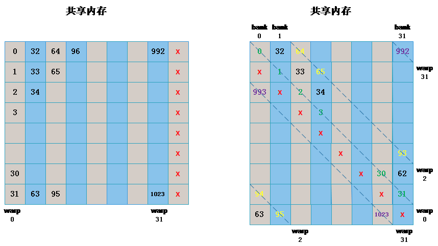

#**CS433** 并行与分布式程序设计

#Project3实验报告

**Group16**:秦格华 刘宸林

##1 Matrix Transpose的CUDA实现

矩阵的转置（Matrix Transpose）是矩阵基本运算之一，基本操作如下：


即将原矩阵A的行变换为新矩阵B的列。

###1.1 CPU Transpose

如果想简单地实现这一操作，我们可以很快写出对应的简单CPU串行程序：


```c

for(int i = 0; i < rows; i++)

   for(int j = 0; j < cols; j++)

		transpose[i][j] = matrix[j][i]

```


这里新的二维数组`transpose[][]`即为我们存储转置后的矩阵。可以从代码很简单地看出因为执行时是对原数组的每一个元素进行依次操作的，所以实际上这一转置过程需要建立在单个元素的值的传递上进行$\#row \times \#column$次，导致本来看似简单的操作会占用大量的计算时间。


###1.2 Naive GPU Transpose

由GPU对矩阵的高效处理的特性可以很容易想到，我们是否可以将转置的计算放在GPU上进行，这样就可以同时处理所有的元素的操作：


```c
__global__ void matrixTranspose(int *a, int *b)

{

	int i = blockIdx.y * blockDim.y + threadIdx.y; // row

	int j = blockIdx.x * blockDim.x + threadIdx.x; // col

	int index_in = i*N+j; // (i,j) from matrix A

	int index_out = j*N+i; // transposed index

	b[index_out] = a[index_in];

}

```

首先这里应用了CUDA程序的相关特性（实际上也是C和C++的特性），即多维数组的存储实际上是利用一维数组和相关各维元素范围实现的，所以这里的`index_out`和`index_in`实际上就是此多维数组在内存中的实际存储偏移量，而`index_in`对应原数组的存储地址，`index_out`对应转置后该元素应在的存储地址。


另外需要注意的是，GPU在并行计算的时候，是将矩阵分成了多个***block***， 同时每个***block***又拥有多个***threads***。在本次实验的矩阵转置任务中，如何安排***block***和***threads***的数量是需要详细考虑的。


我们这次进行实验的矩阵数据大小为**2048*2048**个`int`类，由于每个数据都是由一个***thread***完成的，所以我们创建的总***threads***的数量不能少于**2048*2048**个。最终，我们决定使用**64x64**个***block***，同时每个***block***内有**32x32**个***threads***。代码如下：

```c
	dim3 grid(64, 64);  //number of blocks
	dim3 block(32, 32); //number of threads for each block
	......
	matrixTranspose<<<grid, block>>>(d_a, d_b);
```


###1.3 Shared Memory

由于在Naive GPU Transpose的方法中，对于显存的访问是非常分散的，我们可以自然的想到，是否可以想办法提高显存访问的连续性？

使用**Shared Memory**的方法可以很轻松的解决这个问题。我们在进行矩阵转置的时候，令GPU中的每个***block***（可以视为一个核）申请自己的**Shared Memory**，这块内存对所有的***threads***来说都是共享的。


首先将矩阵按照转置的顺序存入**Shared Memory**当中，当所有线程完成任务后，再将**Shared Memory**中的数据统一拷贝至目标矩阵。

在这个过程中我们需要涉及到进程同步的问题，只要使用`__syncthreads()`即可解决。

最后，由于我们每个***block***拥有**32x32**个***threads***，所以对于每个***block***，**Shared Memory**的大小也应该是**32x32**。

代码如下：

```c
__global__ void matrixTransposeShared(const int *a, int *b)

{

	__shared__ int mat[32][32];

	int bx = blockIdx.x * 32;

	int by = blockIdx.y * 32;

	int i = by + threadIdx.y; int j = bx + threadIdx.x; //input

	int ti = bx + threadIdx.y; int tj = by + threadIdx.x;

	//output

	if(i < N && j < N)

		mat[threadIdx.x][threadIdx.y] = a[i * N + j];

	__syncthreads(); //Wait for all data to be copied

	if(tj < N && ti < N)

		b[ti * N + tj] = mat[threadIdx.y][threadIdx.x];

}

```


###1.4 No Bank Conflict
为了提高内存读写带宽，共享内存被分割成了32个等大小的内存块，即Bank。因为一个Warp有32个线程，相当于一个线程对应一个内存Bank。
理想情况下就是不同的线程访问不同的bank，可能是规则的访问，如线程0读写bank0，线程1读写bank1，也可能是不规则的，如线程0读写bank1，线程1读写bank0。这种同一个时刻每个bank只被最多1个线程访问的情况下不会出现Bank conflict。特殊情况如果有多个线程同时访问同一个bank的同一个地址的时候也不会产生Bank conflict，即broadcast。但当多个线程同时访问同一个bank不同地址时，Bank conflict就产生了。例如线程0访问地址0，而线程1访问地址32，由于它们在同一个bank，就导致了这种冲突。
由于在本次实验中，申请的共享内存大小为**32x32**，恰好相当于32个bank，如果我们的线程访问顺序与bank的方向相同，那么该线程块中的每个 warp 读写相同的 bank 的不同地址，不同的 warp 访问不同，也就是一一对应的关系，这是很严重的bank conflict。


消除这种bank conflict的方法是在申请**Shared Memory**的时候多申请一个附加列，使原来在一个 bank 中的同一个 warp 都正好偏移到了不同的 bank 中。


代码如下：

```c
__global__ void matrixTransposeShared(const int *a, int *b)
{
	__shared__ int mat[32][33];
    ......
}
```
    
###1.5 Loop Unrolled
由于在本次实验中，我们在每个block中使用了**32x32**个threads，这实际上是一个很大的量。为了提高性能，我们需要缩减创建的threads的数量，这就意味着相比起以前，一个thread需要执行更多的操作。
本来，每个thread的操作是移动一个固定位置的数据，如果我们讲thread的数量缩小为1/4，即**32x8**， 那么每个thread就需要对4个数据进行操作。
在此之外，我们还可以从编译层面对程序进行优化。由于每个thread需要进行多个操作，这就涉及到循环的使用。实际上，在循环次数比较小的情况下，我们可以使用`#pragma unroll` 语句对循环进行展开，也就是将循环展开成多条单个的语句，以提高代码的性能。

main函数中，block大小的定义需要改变：

```c
	dim3 grid(64, 64);
	dim3 block(32, 8);
```
具体的循环展开代码如下：

```c
const int TILE = 32; const int SIDE = 8;
__global__ void matrixTransposeUnrolled(const int *a, int *b)
{
	__shared__ int mat[TILE][TILE + 1];
	int x = blockIdx.x * TILE + threadIdx.x;
	int y = blockIdx.y * TILE + threadIdx.y;

	#pragma unroll TILE/SIDE
	for(int k = 0; k < TILE ; k += SIDE) {
		if(x < N && y + k < N)
			mat[threadIdx.y + k][threadIdx.x] = a[((y + k) * N) + x];
	}

	__syncthreads();

	x = blockIdx.y * TILE + threadIdx.x;
	y = blockIdx.x * TILE + threadIdx.y;

	#pragma unroll TILE/SIDE
	for(int k = 0; k < TILE; k += SIDE) {
		if(x < N && y + k < N)
			b[(y + k) * N + x] = mat[threadIdx.x][threadIdx.y + k];
	}
}	

```

## ２　计时方法
出于对之前MPI中计时函数出错导致结果出现偏差的现象的考虑，这次我们在调用计时函数时，优先考虑了CUDA本身的计时函数。CUDA的计时主要由两种解决办法：

* 1.CPU端计时，即主机端计时
*  2.GPU端计时，即设备端计时

如果是对于每个并行的部分进行计时即设备端计时，则我们可以利用CUDA內建的API来机型计时：

```c
…
float time;
cudaEventCreate(&start);
cudaEventCreate(&stop);
cudaEventRecend(start,0);
{
… //codes needing to be timed
}
cudaEventRecend(stop,0);
cudaEventElaspedTime(&time,start,stop);
cudaEventDestroy(start);
cudaEventDestroy(stop);
…
```

但是在本次实验中，我们需要计算的是整个并行过程所消耗的时间，也就是从host向device发布任务到device完成任务之间的时间。
由于GPU运算前需要将数据从内存中拷贝到显存，在完成计算之后需要将数据从显存拷贝至内存，我们只需要计算CPU执行这两次拷贝操作之间的时间差即可得到并行所耗时间。
利用c/c++自带的`clock()`函数可以轻松的完成计时任务，具体代码如下：

```c
#include <time.h>
......
int main(){
	clock_t start, end;
    ......
    start = clock();
	//Copy inputs to device
    ......
    //Launch kernel
    ......
    // Copy result back to host
    ......
    end = clock();  
    cout << "Totle Time : " <<(double)(end - start)<< "ms" << endl;
}
```

##3 硬件信息
* 显卡型号：GeForce GTX 770M
* 驱动程序版本： 369.30
* CUDA 核心： 960
* 图形时钟： 705MHz
* 显存： 4GB
* 内存数据速率： 4008MHz
* 内存接口： 192-位
* 内存带宽： 96.19GB/s

##4 实验结果
本次实验所使用的参数如下：

* 矩阵大小： 2048x2048 (int)
* 迭代次数： 100
* block数量： 64x64
* threads数量： 32x32 per block

|  | Time(ms) | Bandwidth(GB/S) | Step Speedup | Speed up VS CPU | 
|--------|--------|--------|--------|--------|--------|--------|--------|
| CPU | 4370| 0.716 | | |
|Naive Transport|195| 16.026| 22.383 | 22.383|
|Coalesced Memory|183| 17.077 | 1.066| 23.383|
|Bank Conflicts|155| 20.161| 1.181| 28.158|
|Loop Unrolling|130| 24.038| 1.192|33.573|

可以看出，所使用的优化方法均得到了较明显的加速。其中在Loop Unrolling的优化措施下加速比甚至达到了33+倍，是所有措施中加速表现最好的一种，这当然也是因为我们在做过前面的一步步优化后此时已达到了最佳的优化情况。


