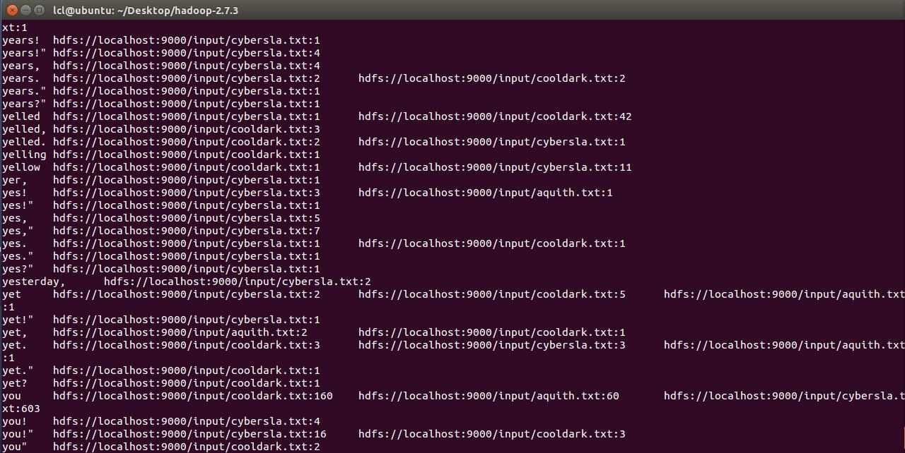

#**CS433** 并行与分布式程序设计

#Project4实验报告

**Group16**:秦格华 刘宸林

##Introduction

本次project我们实现了基于Hadoop和C语言的文件倒排索引程序。关于文件倒排索引，顾名思义的话就是统计文档中词频，并通过倒序的方式将其再次排列。而将其简单实现在分布式文件系统HDFS上是主要通过MapReduce操作来进行的。

实际上MapReduce是两个操作：`Map`和`Reduce`。`Map`把一个文件进行分割（在本实验中分隔符统一默认为空格`\t`），每遇到一个单词w，就产生一个中间键值对`<w, "1">`，表示又找到了一个单词w。而`Reduce`则接受单词w，并按照`Map`的分割结果统计该单词w在整个文档中的出现次数。


上图是老师上传的参考书中的关于MapReduce的流程图。一切都是从最上方的user program开始的，user program链接了MapReduce库，实现了最基本的Map函数和Reduce函数。执行顺序如下：

>**1.**	MapReduce库先把user program的输入文件划分为M份（M为用户定义），每一份通常有16MB到64MB，如图左方所示分成了三块Input Data；然后使用fork将用户进程拷贝到集群内其它机器上。 

>**2.**	user program的副本中有一个称为master，其余称为worker，master是负责调度的，为空闲worker分配作业（Map作业或者Reduce作业），worker的数量也是可以由用户指定的。 

>**3.**	被分配了Map作业的worker，开始读取对应分片的输入数据，Map作业数量是由M决定的，和Input Data划分的块一一对应；Map作业从输入数据中抽取出键值对，每一个键值对都作为参数传递给map函数，map函数产生的中间键值对被缓存在内存中。 

>**4.**	缓存的中间键值对会被定期写入本地磁盘，而且被分为R个区，R的大小是由用户定义的，将来每个区会对应一个Reduce作业；这些中间键值对的位置会被通报给master，master负责将信息转发给Reduce worker。 

>**5.**	master通知分配了Reduce作业的worker它负责的分区在什么位置（肯定不止一个地方，每个Map作业产生的中间键值对都可能映射到所有R个不同分区），当Reduce worker把所有它负责的中间键值对都读过来后，先对它们进行排序，使得相同键的键值对聚集在一起。因为不同的键可能会映射到同一个分区也就是同一个Reduce作业（谁让分区少呢），所以排序是必须的。 

>**6.**	reduce worker遍历排序后的中间键值对，对于每个唯一的键，都将键与关联的值传递给reduce函数，reduce函数产生的输出会添加到这个分区的输出文件中。 

>**7.**	当所有的Map和Reduce作业都完成了，master唤醒正版的user program，MapReduce函数调用返回user program的代码。 


而且我们要注意Map/Reduce作业和`map`/`reduce`函数的区别：Map作业处理一个输入数据的分片，可能需要调用多次`map`函数来处理每个输入键值对；Reduce作业处理一个分区的中间键值对，期间要对每个不同的键调用一次`reduce`函数，Reduce作业最终也对应一个输出文件。

##Implementation

因为助教给出的`mapper.c`已经基本正确实现了map函数，我们除了便于调试更改了输入流以外并没有更多地更改，不过我们在其中加了以下语句：

```c
  while(fgets(line, BUF_SIZE - 1, stdin) != NULL){
        int i;
        filepath = getenv("mapreduce_map_input_file");
        //……
  		 while(token != NULL){
            printf("%s\t%s\t1\n", token, filepath);
            token = strtok(NULL, DELIMITERS);
        }
  }
```

这里利用函数`getenv()`获取输入文件的路径，并将此路径记录在变量`filepath`中，打印时将`token`和`filepath`组成二维键值对一起打印，这样就得到了map的结果。

我们利用助教给出的C语言的代码框架，对`reducer.c`进行修改，代码实现如下（具体解释可见代码中注释）：

```c
int main(int argc, char ** argv){

    char line[BUF_SIZE];
    char line2[BUF_SIZE];
    char * word = NULL;
    char * addr = NULL;
    int count = 0;

    while(fgets(line, BUF_SIZE - 1, stdin) != NULL){
        int i;
        for(i = strlen(line); i >= 0; i--){
            if(line[i] == '\n' || line[i] == '\r'){
                line[i] = '\0';
            }
        }

        char * token = strchr(line, '\t');
        int len_word = token - line;
        strncpy(line2, token+1, strlen(line)-len_word);
        char * token2 = strchr(line2, '\t');
        int len_addr = token2 - line2;

        if(token != NULL){
            if(word == NULL){
                word = (char *)malloc(sizeof(char) * (len_word + 1));
                strncpy(word, line, len_word);
		        word[len_word] = 0;
                printf("%s", word);
            }
            if(addr == NULL){
                addr = (char *)malloc(sizeof(char) * (len_addr + 1));
                strncpy(addr, line2, len_addr);
                addr[len_addr] = 0;
            }
            if(strncmp(word, line, len_word) != 0){ //key相同
                printf("\t%s:%d\n", addr, count);

                free(word);
                word = (char *)malloc(sizeof(char) * (len_word + 1));
                strncpy(word, line, len_word);
                word[len_word] = 0;
                printf("%s", word);

                free(addr);
                addr = (char *)malloc(sizeof(char) * (len_addr + 1));
                strncpy(addr, line2, len_addr);
                addr[len_addr] = 0;
                count = 0;
            }
            else if(strncmp(addr, line2, len_addr) != 0){ //key不同
                printf("\t%s:%d", addr, count);
                free(addr);
                addr = (char *)malloc(sizeof(char) * (len_addr + 1));
                strncpy(addr, line2, len_addr);
                addr[len_addr] = 0;
                count = 0;
            }
            count++;
        }
    }

    printf("\t%s:%d\n", addr, count);

    if(word != NULL){
        free(word);
    }

    if(addr != NULL){
        free(addr);
    }

    return 0;
}

```

在我们的实现中，主要思路是先比较key，如果key相同则再比较addr（即键值对中的文件地址），若addr也相同则直接执行`count++`，表明这个key在同一个文本内又一次出现；若key相同而addr不相同，我们这里声明了一个`line2`的变量用来存储下一行的元素的地址（即对map后的对象的下一行），此时说明了同一个key值出现在了不同的文本中，需要将`line2`中的addr拷贝到`line`的后面。

##Result

我们利用助教给出的`input.txt`中的三个文本文档作为测试材料，将其布置在我们搭建好的Hadoop伪分布式环境中，之后在Hadoop上通过Streaming Tool运行我们的程序，下图为程序运行的时截图：



得到的输出如下：

```
lay	hdfs://localhost:9000/input/cybersla.txt:14	hdfs://localhost:9000/input/cooldark.txt:5
lay,	hdfs://localhost:9000/input/cybersla.txt:1
layer	hdfs://localhost:9000/input/cybersla.txt:1	hdfs://localhost:9000/input/cooldark.txt:1
layers	hdfs://localhost:9000/input/cooldark.txt:3	hdfs://localhost:9000/input/cybersla.txt:1
laying	hdfs://localhost:9000/input/cybersla.txt:1	hdfs://localhost:9000/input/cooldark.txt:3
layout	hdfs://localhost:9000/input/cooldark.txt:3
lead	hdfs://localhost:9000/input/cooldark.txt:4	hdfs://localhost:9000/input/cybersla.txt:10	hdfs://localhost:9000/input/aquith.txt:2
```

可以看出针对每一个key，我们已经将其倒排索引出了其出现的位置和相关文件中的出现次数。但稍有不足的是，因为我们在map时是按空格来进行分割的，然而标点符号出现时与前一个字母是相邻的，所以mapper并不能将其分割开来。

至此，我们的Project4全部完成。

##What's More
虽然这门课是一门大四的专业选修课，但是因为上学期在学习操作系统中关于进程与线程的并行和分布式系统的初步介绍后对这方面的应用和知识有了很大兴趣，所以我们这个学期就选了这门课作为进一步了解并行与分布式编程的正式入门。

大概是因为是一门大四的选修课的缘故，我们觉得本次课程的作业量并不算大，但是每一次project都使我们留下了深刻的印象：第一次project有关测量MPI时间的讨论，第二次nbody问题中关于通过优化算法进一步提高并行程序效率的bonus问题，第三次CUDA编程中与底层的硬件性能息息相关的代码设计，这一次Hadoop实验中在自己的电脑上搭建分布式系统的过程……这四次实验不仅难度合适，并且较好的开放性答案和解法都让我们在做实验时通过查找资料和对比结果中对并行编程有着更深的认识。虽说不能说通过这门课就已经精通了MPI、OpenMP、CUDA还有Hadoop，但是确着实使我们对并行与分布式计算方面产生了更深的兴趣，希望以后有机会还可以进一步地了解。

最后再次感谢邓老师和两位助教为我们精心准备的project，当然还有每次都为我们耐心的解答！