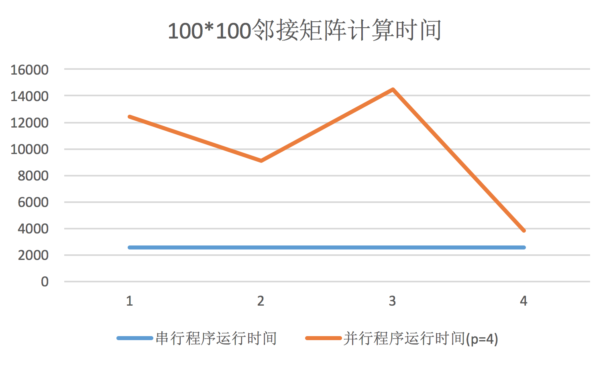
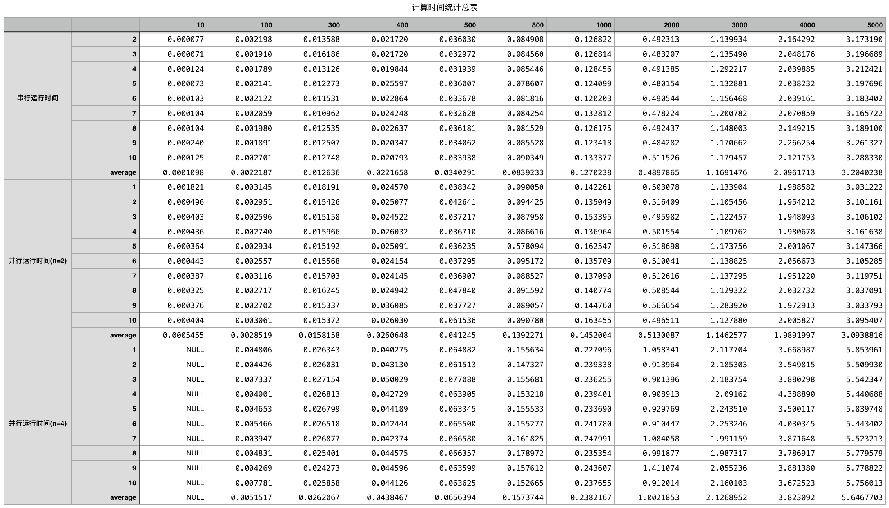
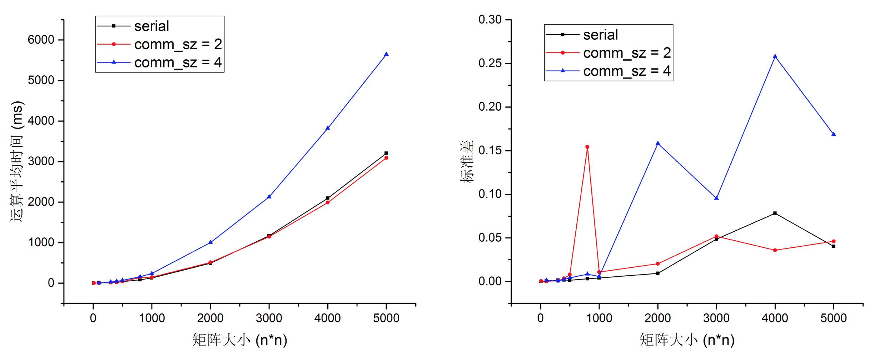
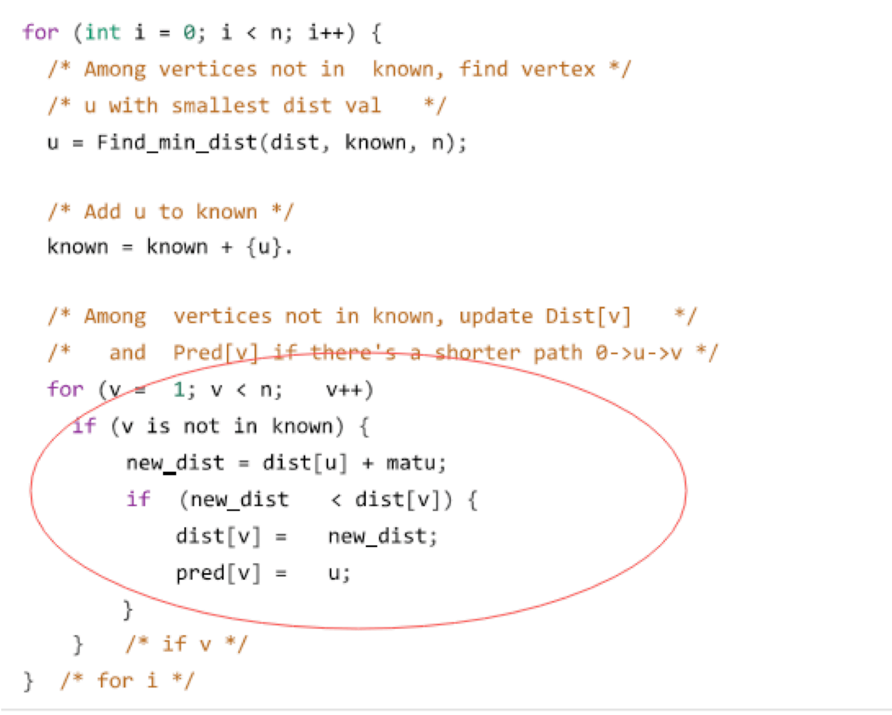
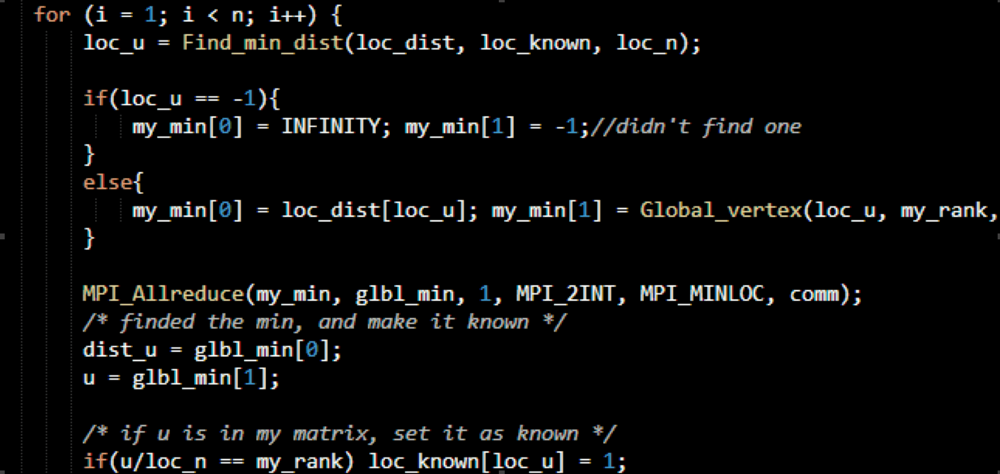
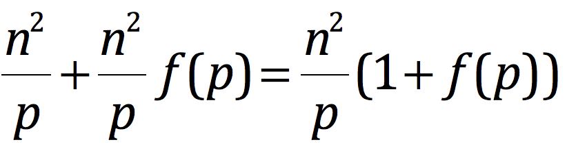

#**CS433** 并行与分布式程序设计
#Project1实验报告
**Group16**:秦格华 刘宸林
##1 代码实现中遇到的问题及解决
Dijkstra算法的基本实现在说明文档中已有源码和十分详尽的描述，在此主要结合我们已完成的并行化代码进行并行化的解释说明，以及在实现过程中遇到的问题及其解决方法。

###1.1 并行化代码中遇到的问题
首先应该确定，并行化的方法是将原n*n的有向邻接矩阵按列划为p个块，这样每个块内可以分到n/p（前提是p可以整除n）个点及其与所有点的直接连通分量，之后在每个块内执行`Find_min_dist（）`操作，在每个块内找到其路径最短的连通节点后，先将其翻译为在全部矩阵内的序号，再在算法调用块`oid Dijkstra()`内进行`MPI_Allreduce()`，获得这些值中的最小值，则该值对应的节点即为我们下一步进行每个块内进行搜索最短路径的跳板。

因为并行化后各个进程是同时进行的，并且每个进程实际上除了在搜索完成后进行同信时之间才会有联系，在将数组分为n/p个块后，我们定义的函数基本只会对自己的块中的数据进行操作，所以基本的并行思想就是将串行程序中的函数参数并行化，并添加并行所需要的通信参数。而这一过程大都相似，实现并不复杂。下面我们以`Find_min_dist()`函数为例展示并行前后并行后的代码对比：


并行前：

```
int Find_min_dist(int dist[], int known[], int n) {
	 int v, u, best_so_far = INFINITY;

   	 for (v = 1; v < n; v++)
      if (!known[v])
         if (dist[v] < best_so_far) {
            u = v;
            best_so_far = dist[v];
         }
   return u;
} 
```
并行后：

```
int Find_min_dist(int loc_dist[], int loc_known[], int loc_n) {
	int loc_v, loc_u=-1, best_so_far = INFINITY;

	for (loc_v = 0; loc_v < loc_n; loc_v++)
		if (!loc_known[loc_v])
			if (loc_dist[loc_v] < best_so_far) {
				loc_u = loc_v;
             best_so_far = loc_dist[loc_v];
           }
	return loc_u;
}  
```
从上面代码段可以看出，并行的主要工作及将传入函数的参数改为每个block的local值。当然，需要通信的函数需要另外加入关于通信空间和进程rank的参数传递，以便完成进程间的顺利通信。如`Print_dists()`函数中，由于在完成最短路径的寻找后，root到各个点的最短路径仍是存在各个块下的，所以需要Gather所有进程，并将其存入一个数组中进行打印。这里因为涉及到了进程间通信，所以在函数参数中就必须在原串行程序的基础上加入通信空间的参数`comm`用于确定通信空间和`my_rank`用于确定当前进程的等级。

实际上，在整个程序的并行过程中，遇到较为棘手的问题是将一个n*n的数组通过怎样的传递函数先将其分为大小为n/p的p个块，再将其按照`my_rank`相应的分配。简单的想法是通过`MPI_Bcast()`函数将数组从根进程中按块分别分配给各个进程，回收时再进行整合。但是这样的问题在于如果数组较大则不仅传输的时间不可忽视，数组本身分配给各个进程后占的空间也不可忽视。所以我们寻求更为方便的数据传输方法。

这里我们可以利用MPI的数据类型`MPI_Datatype`建立针对矩阵的传递函数：`block()`。参考网上文献对`MPI_Datatype`类函数的介绍（<http://www.docin.com/p-380950690.html>），其中最重要的是`MPI_Type_vector()`函数，其可以创建n个数据块，并且可以指定各个块之间的位移为n，从而为每一个进程申请到了一个单独的向量空间。随后在函数`Read_matrix()`中，我们利用通信函数`MPI_Scatter()`将矩阵分配给各个进程的vector中，从而实现了矩阵的传递。

###1.2 测试中遇到的问题
因为并行程序与串行程序执行上的主要区别体现在计算效率上，即并行程序与串行程序相比，相同大小的计算量耗时会减少。所以我们这里测试的主要方法即为计算串行与并行程序对相同有向邻接矩阵进行Dijkstra算法计算时的运行时间。

C语言中计算程序运行时间的方法有很多种，这里不一一列举。我们采用了在主函数开头定义一个变量`a`并利用系统头文件`time.h`中的`clock()`函数为其赋值，在主函数结束前再次调用此函数为一个新定义的变量`b`，输出`b-a`的值即代表了运行程序所花费的时间（`b-a`返回的实际上是CPU为运行这段程序所消耗的时钟周期数）。

这里遇到的主要问题是，在前期进行测试时，并行程序得到的运行时间不仅比串行程序的运行时间大2~10倍，而且对同一个邻接矩阵的运行时间也有很大的随机性，针对100*100的矩阵我们进行了四组对比实验，得到的结果如下图所示：

可以从图中看出，并行计算耗费时钟周期普遍高于串行计算时间（当然，这一问题在我们调整过的程序中仍然有存在的部分情况，原因我们会在结果分析中阐述），更令人疑惑的是其消耗时间并不稳定，在测试次数较少的情况下甚至可以讲是随机的，这显然有存在问题。我们认为在假设并行程序不出错并且mpich环境对并行程序的支持是稳定的前提下，问题可能主要存在于计时步骤。观察原来的计时代码：

```
int main(int argc, char *argv[]){
	//declarations
	int a = clock();
	/*
		PARALLEL CODE SECTION…
	*/
	int b = clock();
	printf("timeUse: %d /n", b-a);
   	/*
   		RECYCLING
   	*/
   return 0;
```
我们这里发现了问题：每个进程都可能会执行一次关于计时的操作，可能造成输出的时间差并不是我们所希望的所有进程执行完后整个程序的执行时间，而是来自任意一个进程的运行时间！

当然解决问题的方法也并不复杂，与之前并行化代码中的技巧相似，我们可以通过`my_rank`这个参数保证只计算根进程的运行时间（因为所有的进程结束运算后都会`MPI_Allreduce()`到根进程，而根进程自始至终都是参与运行的），从而得到正确的程序运行时间。改正后的代码示意如下：

```
int main(int argc, char *argv[]){
	//declarations
	if(my_rank == 0)
		int a = clock();
	/*
		PARALLEL CODE SECTION…
	*/
	if(my_rank == 0){
		int b = clock();
		printf("timeUse: %d /n", b-a);
   	}
   	/*
   		RECYCLING
   	*/
   return 0;
```
改正后，经过多次运行测试，并行程序的运行时间已基本稳定。

但是经过简单的几次测验，发现这样得到的并行计算时间还是大于串行计算时间2倍以上，我们继续检查代码中的问题，在确定并行方法没有错误的情况下，我们只能通过查找资料来分析问题出现的原因。意外地，我们在《并行程序设计导论》中找到了以下原话：

>`MPI_Wtime`和`GET_TIME`都返回墙上时钟时间。回想一下，C语言中的`clock()`函数返回的是CPU时间（包括用户代码、库函数以及系统调用函数所消耗的时间），但它不包括空闲时间，而在并行程序中，很多情况下都是空闲等待状态。例如，调用`MPI_Recv`会消耗很多时间来等待消息的到达。而墙上时钟给出了所经历的全部时间，包括空闲等待时间。

也就是说，如果我们使用`clock()`函数进行计时就忽略了并行计算中各个进程中的等待时间，实际上是一定程度上减小了并行计算多出来的时间开销的。而正确的计时应该是使用MPI计时函数`MPI_Wtime()`。这一函数的使用也较简单，只要在根进程第一次执行`MPI_Bcast()`时定义一个新的`double`类型变量并记录此时时间，再在并行计算完成释放内存前再次调用`MPI_Wtime()`，并将其赋给一个新的`double`变量，则此时输出两个计时变量的差值即为计算的总时间。改正后代码变为如下情况：

```
int main(int argc, char *argv[]){
	//declarations
	if(my_rank == 0)
		double a = MPI_Wtime();
	/*
		PARALLEL CODE SECTION…
	*/
	if(my_rank == 0){
		double b = MPI_Wtime();
		printf("timeUse: %f /n", b-a);
   	}
   	/*
   		RECYCLING
   	*/
   return 0;
```
当然，最后一次改正计时方式后，并行计算的速度整体上来说还是慢于串行的（尤其是增加并行进程数后），我们将在随后的分析中尝试解释这一现象的原因。

另外，由于时间复杂度分析需要，我们需要得到通信消耗时间，基本原理同上，并且由于`MPI_Allreduce()`的执行次数明显是其他通信函数的n倍，所以粗略地，我们仅需要计算`MPI_Allreduce()`的每次通信时间，具体代码实现仍在` Dijkstra()`中：

```
void Dijkstra(…）{
…
…
       if( my_rank == 0){
           start = MPI_Wtime());
           MPI_Allreduce(my_min, glbl_min, 1, MPI_2INT, MPI_MINLOC, comm);
           end = MPI_Wtime();
           printf("timeUse4Allreduce: %f /n", end - start);       }
       else
           MPI_Allreduce(my_min, glbl_min, 1, MPI_2INT, MPI_MINLOC, comm);
…
…
}

```
当然，为了方便进行测试，我们也在`main()`的开头加入了输入流重定向函数`freopen("XXX.txt", "r", stdin)`，这样可以将生成的邻接矩阵直接输入到输入流中，在测试中只需要改变测试的矩阵文档即可。
##2 实验结果
由于我们在自己的4-core处理器机器上完成了实验，所以能为实验提供的进程数最多只能为4。我们在每一规模数组下分别进行了十组平行实验，共收集了**320**组数据（其中因为10不能被4整除，故没有采集对应进程数下的运算时间）。

下面是我们针对不同规模数组，在串行、双进程并行，四进程并行的情况下计算不同规模的数组的消耗时间折线图。

从结果可以看出，双进程条件下并行计算的运行时间稍稍低于串行计算时间，但是同样的对于四进程条件下并行计算的时间远高于串行计算时间，一般为串行程序的1.5~2倍。

另外值得注意的是，从各组数据的标准差大小上可以看出，并行程序的计算效率稳定性并不如串行程序，并且在多次测量中均发现了在并行计算下，异常数据的出现频率和异常幅值明显大于串行程序。这一问题应该是由于不同进程在并行计算时，可能与系统内的其他进程存在调度情况，若一个进程被调度次数较多，那么可能根进程程序就会在这里等待其结束，导致计时变长。根据系统分析原则，出现这一情况的可能性应该是与并行进程数呈正相关的。
##3 结果分析
并行的Dijkstra算法和非并行的Dijkstra算法都能得到正确答案，但是从运行时间上来看，结果一开始令我们非常匪夷所思。

从横向比较来看，随着n的增长，运行时间也大致按照n<sup>2</sup>的速度增长，这符合Dijkstra的O(N<sup>2</sup>)的时间复杂度，但是从纵向比较来看，结果就与预期有很大出入：并行的Dijkstra程序不仅没有得到加速，在comm_sz=4的情况下，运行时间甚至达到了非并行Dijkstra的两倍左右！

下面对这个问题进行具体的分析：

Dijkstra算法的主要时间消耗都集中在寻找下一个距离根节点最短的节点的操作中，也就是如下的操作



其中寻找下一个最近节点的比较操作一共进行了n<sup>2</sup>次，所以Dijkstra算法的时间复杂度是O（N<sup>2</sup>）的。在并行的Dijkstra中，我们将n个节点平均分给p个process，各个process并行的计算各个节点集合中距离根节点最近的节点，再将p个候选点集合后选出距离最近的节点，这一步操作是由MPI_Allreduce()函数完成的。

在理想情况下，各个process在每次循环中进行了n/p次比较，p个process并行计算所以总的花费时间应该是n×n/p，相比非并行的n×n快了p倍。

但是如果考虑到进程通信所耗费的时间，结果就大不相同了。在并行Dijkstra算法中用到的有以下通信函数：

>MPI_Bcast(): 用于初始化，进程0将读入的n值广播给其他进程
>
>MPI_Scatter(): 用于分配矩阵的数据，进程0将对应的矩阵块分配给其余进程
>
>MPI_Allreduce(): 用于从各个进程的候选节点中寻找最近的节点
>
>MPI_Gather(): 用于在输出时收集各个节点的数据

其中除了`MPI_Allreduce()`函数以外，其余各个函数均只执行了一次，假设一次集合通信的时间复杂度为O（n），最终并不会对O（n^2）的Dijkstra算法产生决定性的影响，所以我们主要分析`MPI_Allreduce()`函数。

`MPI_Allreduce()`在程序中所处的位置如下：


在每次寻找最近节点的操作中，都需要调用`MPI_Allreduce()`函数，整个程序中一共调用了n次。为了弄清楚`MPI_Allreduce()`的时间消费，我们对每次`MPI_Allreduce()`函数的耗费时间进行了测算，以下是规模为1000的输入里，其中几次`MPI_Allreduce()`的结果：

```
…
timeUse4Allreduce: 0.000052 
timeUse4Allreduce: 0.000004 
timeUse4Allreduce: 0.000084 
timeUse4Allreduce: 0.000089 
timeUse4Allreduce: 0.000125 
timeUse4Allreduce: 0.000122 
timeUse4Allreduce: 0.000061 
timeUse4Allreduce: 0.000116 
timeUse4Allreduce: 0.000121 
timeUse4Allreduce: 0.000113 
timeUse4Allreduce: 0.000117 
timeUse4Allreduce: 0.000108 
timeUse4Allreduce: 0.000114 
timeUse4Allreduce: 0.000169 
…

```
规模为1000的输入所耗费的时间也仅仅为238ms左右，而一次`MPI_Allreduce()`所耗费的时间就达到了0.1ms！一共进行1000次`MPI_Allreduce()`操作则这一过程上花费的时间将达到100+ms！

根据`MPI_Allreduce()`函数的原理及实验得到的运行时间，我们猜测其时间复杂度应该是O(n)，`MPI_Allreduce()`收集每个进程的n/p个数据并相加，计算次数大约是n/p。显然，将数据分散的操作时间与进程数p相关，设为f(p)。

具体进行的比较次数应该是n/p*f(p)，其中n为每个进程的数据范围，p为总进程数，f(p)为与p相关的函数。

`MPI_Allreduce()`函数一共执行了n次，所以总的时间复杂度应为O(n^2)，显然，`MPI_Allreduce()`函数会对O(N<sup>2</sup>)的Dijkstra算法造成巨大的影响。
那么，当进程数p和输入数据范围n的关系如何时，才能得到明显的加速呢？
在考虑`MPI_Allreduce()`之后，程序的计算次数约为：





考虑因子(1+f(p))/p，显然，当p较小的时候（为实验中的2或4），(1+f(p))/p很有可能大于1，这就解释了为什么实验结果中并行程序的运行速度反而变慢，其根本原因就在于程序数量太小，从并行上获得的加速不足以抵消由于程序通信所产生的额外时间消费。

至于运行结果中`comm_sz = 4`的情况反而比`comm_sz = 2`的情况要慢，我们给出的解释是，由于p比较小，(1+f(p))/p中f(p)对结果产生主要的影响，所以当p = 4的时候运行时间反而会增加。当然，我们也无法知道运行环境造成的影响有多大，比如说虽然我们使用的是4核的计算机，但是不能保证当`comm_sz = 4`的时候还能像`comm_sz = 2`的时候一样进行理想的并行计算。

实际上，从网上的资料可以知道，MPI在单机多核的表现效果并不是最理想的，因为mpi是基于消息传递的并行编程，就算计算任务能完美的分给CPU的各个核，消费在进程通信上的时间也会极大的降低运行效率，其实MPI更适合用于多台机器的并行运算。对于单机多核，最好的编程模型还是opemMP，因为其是通过共享内存来进行数据传输、同步等操作的，相对效率较高。要想得到完美的加速效果，应该还是要用多台机器，多个节点进行并行计算。

综上所述，只有当p比较大，使得(1+f(p))/p的值小于1的时候，才能获得加速，具体的值还要看集合通信函数的运行效率，也就是f(p)的大小。同时，当输入规模n较小的时候，`MPI_Allreduce()`以外的通信函数也有可能对结果造成影响，所以n的范围应取的较大，从运行结果来看，当n>800之后，`MPI_Allreduce()`以外的通信函数的影响就可以忽略了。
